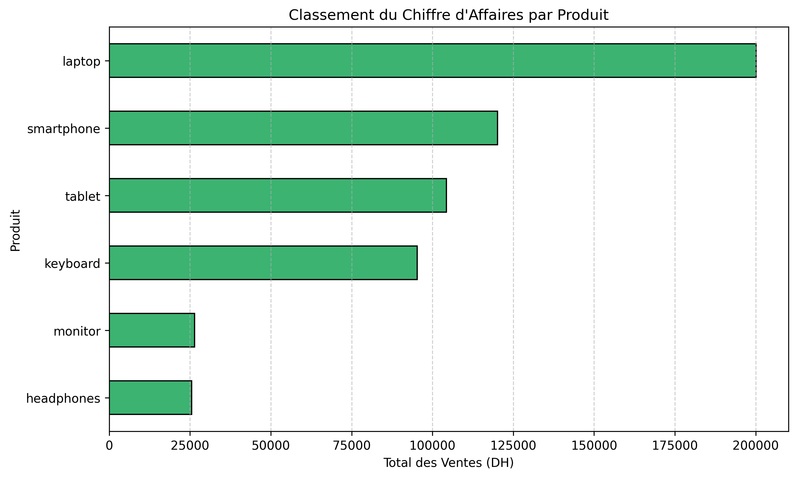
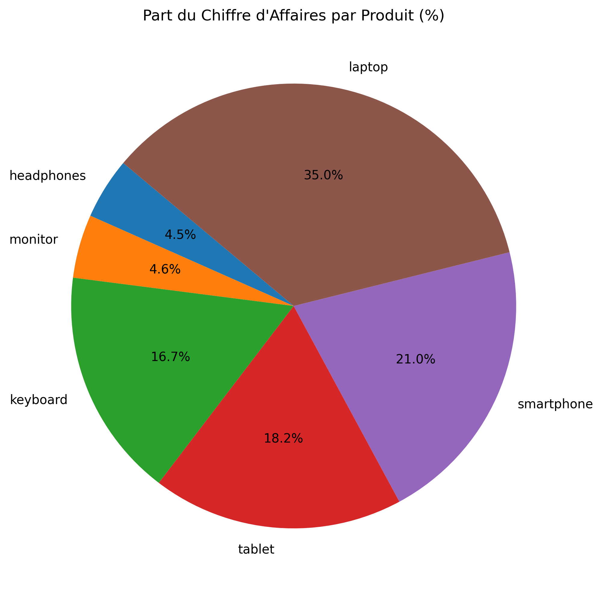
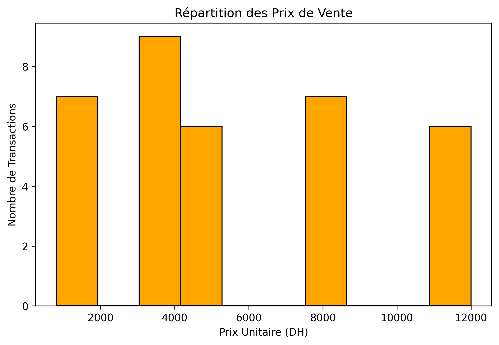
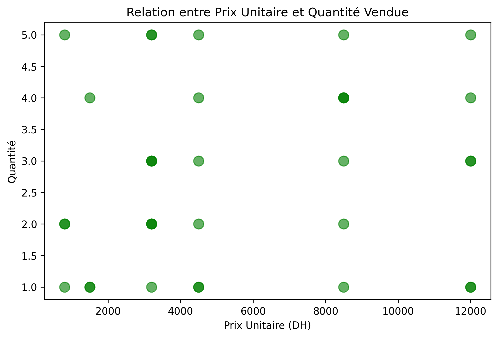

# 📊 Analyse des Ventes & Data Storytelling avec Python

Bienvenue dans ce projet de démonstration ! L'objectif de ce dépôt est de montrer comment transformer des données brutes (souvent "sales" ou incomplètes) en informations stratégiques exploitables pour une entreprise.

## 🎯 Objectif du Projet
Ce mini-projet simule une analyse réelle de performance commerciale. Il est conçu pour aider les débutants en Data Analysis à comprendre l'importance du **Data Cleaning** et comment présenter des résultats de manière professionnelle à un manager.

## 🚀 Workflow de l'Analyse

### 1. Nettoyage des Données (Data Cleaning)
La donnée brute contenait plusieurs erreurs que nous avons traitées pour garantir l'**intégrité des résultats** :
- **Suppression des doublons** : Pour éviter de compter deux fois la même vente.
- **Traitement des valeurs manquantes** : Gestion des lignes où des informations cruciales manquaient.
- **Correction des incohérences** : Suppression ou correction des prix unitaires enregistrés à 0 DH.

### 2. Analyse et Calculs (Pandas & NumPy)
- Création d'une colonne de **Chiffre d'Affaires (CA)** par transaction.
- Mise en place d'une **remise dynamique de 15%** pour les ventes à fort volume afin d'analyser l'impact sur la rentabilité.

## 📈 Visualisations Clés & Insights

Voici les principaux graphiques générés par l'analyse. Chaque visuel apporte une réponse à une question métier précise.

### 1. Performance par Produit
Ce graphique permet d'identifier immédiatement nos moteurs de croissance.

### 2. Part du Marché Interne
Une vue d'ensemble pour comprendre la dépendance de l'entreprise vis-à-vis de certains produits.

### 3. Analyse de la Distribution des Prix
Utile pour voir si nos ventes se concentrent sur le bas, le milieu ou le haut de gamme.

### 4. Relation Prix vs Quantité
Cet insight est crucial : il montre que malgré un prix élevé, la demande reste forte, ce qui suggère une forte **fidélisation client** sur le segment Premium.

## 🛠️ Stack Technique
- **Langage** : Python 3
- **Bibliothèques** : 
  - `Pandas` : Manipulation et nettoyage.
  - `NumPy` : Calculs mathématiques.
  - `Matplotlib` : Création de graphiques.
- **IDE** : Visual Studio Code / Jupyter Notebook

---
*Projet réalisé par **Fatima Ezzahra Barradi**. Si vous avez des questions sur la méthodologie ou le code, n'hésitez pas à me contacter sur [LinkedIn] !*